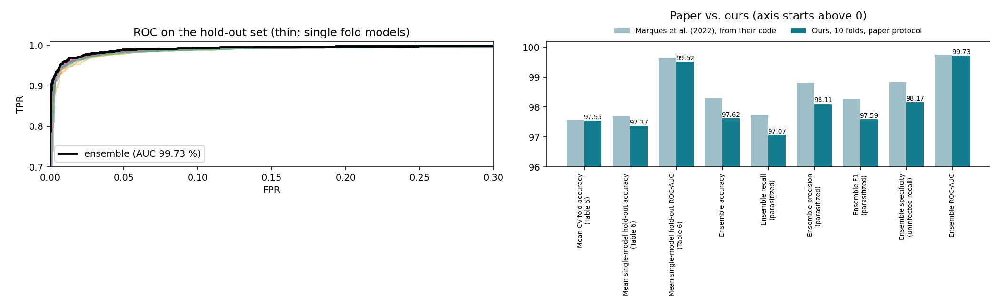

# Automated Malaria Cell Detection


-FF6F00)


Deep-learning classification of single red-blood-cell images as **parasitized** or **uninfected**, built on the
NIH Malaria Cell Images dataset. Phase 2 of our project reproduces the base paper,
**Marques et al. (2022), *An ensemble-based approach for automated medical diagnosis of malaria using EfficientNet***
(Multimedia Tools and Applications 81, 28061–28078), and sets up two hypotheses about how far its accuracy generalises.

<p align="center">
  
</p>

## Highlights

- **Faithful reproduction.** The recipe follows the authors' own executed notebook (Springer supplementary file
  [MOESM1](https://static-content.springer.com/esm/art%3A10.1007%2Fs11042-022-12624-6/MediaObjects/11042_2022_12624_MOESM1_ESM.pdf)),
  not only the paper text. That code differs from the text in eight places, from the pretrained weights to the
  hold-out size. [32 tests](tests/test_marques2022_exact.py) check our implementation against the paper, including
  the exact parameter count of its Table 2 (4,223,934).
- **All 10 folds, in parallel.** One RunPod RTX 4090 per fold, about **11 minutes per fold** against 4 h 46 min
  in the paper. The speed-ups (decoded-image cache, seeded multi-process augmentation, XLA) leave the maths unchanged.
- **Within 1 percentage point of the paper** on every headline metric (table below).
- **Two errors found in the paper**: its text swaps the ensemble's precision and recall, and its code evaluates
  on randomly augmented images. Both are documented and handled ([details](docs/report.md#3-paper-exact-10-fold-reproduction)).
- **Trained weights published**: the 10 fold models are on the
  [release page](https://github.com/amathziah/malaria-detection/releases/tag/v1.0-a0-10fold); nothing has to be retrained.

## Results

Paper-exact reproduction, all 10 folds (`results/A0_10fold_paper/`). The paper's values are those its own
code printed (Supplementary MOESM1); ensemble metrics are on the 5,512-image hold-out set.

| Metric | Marques et al. (2022) | Ours | Δ (pp) |
|---|---:|---:|---:|
| Mean accuracy of the fold models on their CV test part (Table 5) | 97.56 % | **97.55 ± 0.30 %** | −0.01 |
| Mean accuracy of the fold models on the hold-out set (Table 6) | 97.69 % | 97.37 % | −0.32 |
| **Ensemble accuracy** (10 models, softmax averaging) | **98.29 %** | **97.62 %** | −0.67 |
| Ensemble recall, parasitized (sensitivity) | 97.74 % | 97.07 % | −0.67 |
| Ensemble precision, parasitized | 98.82 % | 98.11 % | −0.71 |
| Ensemble F1, parasitized | 98.28 % | 97.59 % | −0.69 |
| Ensemble ROC-AUC | 99.76 % | 99.73 % | −0.03 |
| Ensemble MCC | — | 0.95 | — |

Evaluated on clean (un-augmented) images, the same ensemble scores 97.64 %. A first, lighter reproduction
that followed the paper's text (3 of 10 folds, Kaggle 2× T4) reached 97.38 ± 0.74 % per fold and 97.57 % as an ensemble
([`results/A0_baseline/`](results/A0_baseline)).

## Experiments

| ID | Split | Preprocessing | Question | Status |
|---|---|---|---|---|
| A0 | image-level (paper) | none | Baseline reproduction, paper's text, 3 folds | **done** |
| **A0 · 10-fold** | image-level (paper) | none | Baseline reproduction, paper's code, all 10 folds | **done** |
| A1 | slide-grouped | none | **H1**: does accuracy drop once slide-level leakage is removed? | planned |
| A2 | slide-grouped | YUV + histogram equalisation | **H2**: does stain normalisation recover cross-slide accuracy? (vs. A1) | planned |
| A3 | image-level | YUV + histogram equalisation | Control: is any gain specific to unseen slides? (vs. A0) | planned |

## Method at a glance

| Component | Setting (from the paper's code) |
|---|---|
| Data | NIH Malaria Cell Images: 27,558 cells, 13,779 per class, 200 slide IDs |
| Split | 80 % for stratified 10-fold cross-validation (22,046), 20 % untouched hold-out set (5,512) |
| Model | EfficientNet-B0, noisy-student weights (qubvel `efficientnet` 1.1.1), all layers trainable |
| Head | Global average pooling → Dense 128 → Dense 64 → Dense 32 (ReLU, dropout 0.3 each) → Dense 2 (softmax) |
| Input | cv2 nearest-neighbour resize to 224 × 224, pixels / 255 |
| Augmentation | albumentations 0.5.2: rotate/flip/transpose, noise, blur, shift-scale-rotate, optical/grid/piecewise-affine distortion, CLAHE/sharpen/emboss/contrast/brightness |
| Training | Adam 1e-4, categorical cross-entropy with label smoothing 0.1, batch 16, 33 epochs × 1,240 steps, ReduceLROnPlateau (×0.5, patience 6, min 1e-6), best-val_loss checkpoint |
| Ensemble | Mean of the 10 fold models' softmax outputs |

## Repository structure

```
malaria-detection/
├── notebooks/
│   ├── Phase2_A0_10fold_PaperExact.ipynb             paper-exact 10-fold reproduction (train any folds, build all tables)
│   ├── Phase2_A0_10fold_PaperExact_executed.ipynb    the same, executed: all tables and figures
│   ├── Phase2_Baseline_Reproduction_Marques2022.ipynb            first reproduction (A0, 3 folds) + A1–A3 switches
│   ├── Phase2_Baseline_Reproduction_Marques2022_executed.ipynb   its Kaggle run, with outputs
│   └── Phase2_A0_Results.ipynb                       A0 results viewer
├── src/
│   ├── marques2022_exact.py          the paper's recipe: data, splits, augmentation, model, training, metrics
│   ├── runpod_10fold.py              runs one fold per RunPod GPU and collects the results
│   ├── runpod_requirements.txt       pinned training environment
│   ├── phase2_baseline_marques2022.py first reproduction as a plain script
│   ├── check_results.py              one experiment vs. the paper
│   ├── compare_experiments.py        A0–A3 side by side (H1/H2)
│   └── fill_slide_table.py           writes A0 numbers into the archived deck
├── tests/test_marques2022_exact.py   fidelity tests against the paper and its code
├── results/
│   ├── A0_10fold_paper/              10-fold reproduction: tables, figures, per-fold outputs, pod logs
│   ├── A0_baseline/                  first reproduction (3 folds)
│   └── A1_slide_split/ A2_yuv_slide/ A3_yuv_image/   hypothesis experiments (planned)
├── docs/
│   ├── PROJECT_GUIDE.md / .pdf       visual walkthrough of the whole project (+ figures/)
│   └── report.md                     project report
├── slides/                           long and short presentation decks (+ archive/ of earlier decks)
├── kaggle_run/                       Kaggle kernel configuration used for A0
└── requirements.txt                  dependencies of the helper scripts
```

## Getting started

### Use the trained models (no training needed)

```bash
gh release download v1.0-a0-10fold -R amathziah/malaria-detection -D models/A0_10fold_paper
cd models/A0_10fold_paper && shasum -a 256 -c SHA256SUMS.txt && cd -     # optional integrity check
```

```python
import sys; sys.path.insert(0, "src")
import numpy as np
import marques2022_exact as mx                     # needs the environment in src/runpod_requirements.txt

x = np.stack([mx.load_resized("cell.png")])        # uint8, 224 × 224 × 3, read exactly as in training
model = mx.build_model(weights=None)
probs = []
for k in range(10):                                # the paper's ensemble: average the 10 fold models
    model.load_weights(f"models/A0_10fold_paper/fold_{k}_best.h5")
    probs.append(model.predict(x, verbose=0))
p = mx.ensemble_probs(probs)                       # columns: [Parasitized, Uninfected]
print(mx.TIPOS[p[0].argmax()], f"P(parasitized) = {p[0, 0]:.3f}")
```

### Inspect the results (no GPU needed)

```bash
pip install -r requirements.txt
python src/check_results.py results/A0_10fold_paper     # 10-fold reproduction vs. the paper
python src/check_results.py                             # first reproduction (A0)
```

### Reproduce the 10-fold run

The environment is pinned in [`src/runpod_requirements.txt`](src/runpod_requirements.txt) (TensorFlow 2.15, the last
Keras 2 release, `efficientnet` 1.1.1, `albumentations` 0.5.2 + `imgaug` 0.4.0, `numpy` 1.23.5).

- **One GPU machine:** open `notebooks/Phase2_A0_10fold_PaperExact.ipynb`, set `FOLDS_TO_TRAIN = list(range(10))`
  and run all cells. The NIH dataset (353 MB) is downloaded automatically.
- **RunPod, one GPU per fold** (API key in `$RUNPOD_API_KEY` or `~/.runpod_key`, SSH key registered on RunPod):

  ```bash
  python src/runpod_10fold.py up --folds 0-9      # create pods, install, start training
  python src/runpod_10fold.py watch               # copy each finished fold home, terminate its pod
  ```

  Then run the notebook with `FOLDS_TO_TRAIN = []` to build the paper's tables, the ensemble and the figures.

### Run the tests

```bash
python -m pytest tests/ -q        # in the pinned environment; ~15 s on a laptop CPU
```

## Documentation

- **[Project guide](docs/PROJECT_GUIDE.md)** ([PDF](docs/PROJECT_GUIDE.pdf)): a visual, plain-language walkthrough of the
  dataset, the model and its 4.2 M parameters, the training recipe, the code function by function, how we evaluate
  (folds, ensemble, precision, recall, F1/F2, ROC-AUC, MCC, pp, what a good value is), the results and the hypotheses,
  with a glossary and a one-page presentation cheat sheet.
- [Project report](docs/report.md): method, results, deviations from the paper, findings.
- [Results guide](results/README.md): every output file explained.
- [Slides](slides/): a full 30-slide deck and an 11-slide short version, both with speaker notes.

## Team

Rishihood University. Course project, Phase 2.

| Member | Role |
|---|---|
| J Amathziah ([@amathziah](https://github.com/amathziah)) | Experiments on Kaggle, repository |
| C Murali Madhav ([@HackHeroic](https://github.com/HackHeroic)) | Code: notebooks, reproduction pipeline, GPU runs |
| Ravi Yadav ([@RAVIYADAV6522](https://github.com/RAVIYADAV6522)) | Slides |
| Pugazhendhi J ([@pugazhjs9](https://github.com/pugazhjs9)) | Report |

## References

- G. Marques, A. Ferreras, I. de la Torre-Díez, "An ensemble-based approach for automated medical diagnosis of malaria
  using EfficientNet," *Multimedia Tools and Applications*, 81, 28061–28078, 2022. doi:10.1007/s11042-022-12624-6
- S. Rajaraman et al., "Pre-trained convolutional neural networks as feature extractors toward improved malaria parasite
  detection in thin blood smear images," *PeerJ*, 6:e4568, 2018 (the NIH Malaria Cell Images dataset).
- M. Tan, Q. V. Le, "EfficientNet: Rethinking model scaling for convolutional neural networks," *ICML*, 2019.
