# Automated Malaria Cell Detection — Project Guide

*A plain-language, visual walkthrough of what we built in Phase 2, why we built it that way, and how every piece works.*
*Read it top to bottom once (about 30 minutes); use the [cheat sheet](#8-presentation-cheat-sheet) at the end while presenting.*

| | |
|---|---|
| **Task** | Look at one photo of a red blood cell and say: *parasitized* (malaria) or *uninfected* |
| **Base paper** | G. Marques, A. Ferreras, I. de la Torre-Díez, *An ensemble-based approach for automated medical diagnosis of malaria using EfficientNet*, Multimedia Tools and Applications 81 (2022) 28061–28078 |
| **What we did in Phase 2** | Reproduced the paper exactly as its own published code does it, on all 10 folds, and set up the experiments for our two hypotheses |
| **Headline result** | Mean fold accuracy **97.55 %** (paper 97.56 %) · 10-model ensemble **97.62 %** (paper 98.29 %) · ROC-AUC **99.73 %** (paper 99.76 %) — all within 1 percentage point |

**Contents**

1. [The dataset](#1-the-dataset) — what it is, how big, is it clean, how we split it
2. [The model and its parameters](#2-the-model-and-its-parameters) — EfficientNet-B0, 4,223,934 parameters
3. [Feature engineering](#3-feature-engineering) — what we do (and don't do) to the images
4. [Architecture and training, in depth](#4-architecture-and-training-in-depth) — layers, recipe, ensemble, GPU engineering
5. [Code walkthrough](#5-code-walkthrough) — every important function, with snippets
6. [How we evaluate: folds, ensemble, metrics](#6-how-we-evaluate-folds-ensemble-metrics) — fold, 10-fold, ensemble, precision, recall, F1/F2, pp, what a good value is
7. [Results, improvements and hypotheses](#7-results-improvements-and-hypotheses) — what is validated and what comes next
8. [Presentation cheat sheet](#8-presentation-cheat-sheet) — 10 numbers, 6 sentences, likely questions
9. [Glossary](#9-glossary) — every technical term on one page

---

## 1. The dataset

> **In one sentence:** 27,558 small photos of single red blood cells from the US National Institutes of Health, exactly half infected and half healthy, already cropped and labelled by experts.

### Where it comes from

| | |
|---|---|
| **Name** | NIH Malaria Cell Images Dataset (also on Kaggle as *cell-images-for-detecting-malaria*) |
| **Download** | `https://data.lhncbc.nlm.nih.gov/public/Malaria/cell_images.zip` (353 MB) — our notebook downloads it automatically |
| **Origin** | Giemsa-stained thin blood smears photographed at Chittagong Medical College Hospital, Bangladesh |
| **Patients** | 150 *Plasmodium falciparum*-infected and 50 healthy patients |
| **Labels** | Every cell was annotated by an expert slide reader at the Mahidol-Oxford Tropical Medicine Research Unit, Bangkok |
| **Classes** | `Parasitized` (13,779 images) and `Uninfected` (13,779 images) |

> 💡 **What is a Giemsa-stained thin smear?** A drop of blood spread into a single layer of cells on a glass slide and dyed with Giemsa stain. The stain colours the malaria parasite's DNA purple, which is what both a human technician and our model look for.

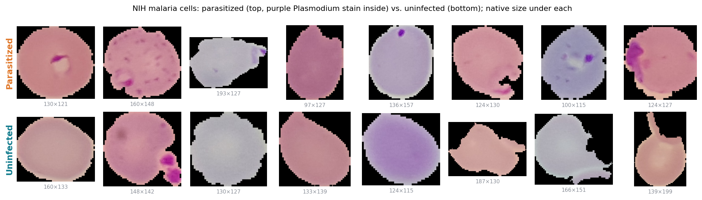

### Size, shape and balance

| Property | Value | What it means for us |
|---|---|---|
| Images | **27,558** | Large enough to train a CNN, small enough to train 10 times |
| Balance | **13,779 / 13,779** (exactly 50/50) | Accuracy is a fair metric; no class re-weighting needed |
| Image size | height 40–385 px (median 130), width 46–394 px (median 130) | Every image is resized to 224 × 224 for the model |
| Colour | RGB PNG, black background around the cell | The background carries no information |
| Slides / patients | **200** slide IDs in the file names | Needed for our leakage hypothesis (H1) |

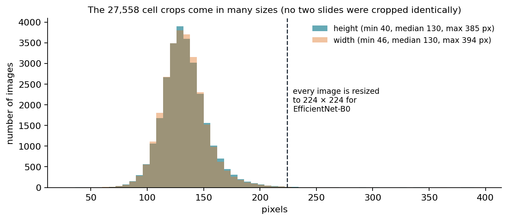

**File names carry the slide ID.** For example `C100P61ThinF_IMG_20150918_144104_cell_162.png`: `C100` is the slide/patient, then the photo, then the cell number. Parasitized cells come from 150 slides; uninfected cells come from all 200 (infected patients also have many healthy cells). **150 slides contribute cells to both classes.** This matters: if we split images at random, cells from the same slide (same patient, same stain batch, same microscope light) land in both training and testing — see hypothesis H1 in section 7.

### Is it clean? Is it "proper"?

| Check | What we found / do |
|---|---|
| Non-image files | Each class folder contains one `Thumbs.db` (a Windows thumbnail cache). Removed, exactly like the paper's code. |
| Exact duplicates | We hashed all 27,558 files (MD5): **0 duplicates**, and no image appears in both classes. |
| Corrupt files | None — every PNG decodes. |
| Class balance | Perfect 50/50 overall; the hold-out set is 2,730 parasitized / 2,782 uninfected (the split is random, as in the paper). |
| Label noise | Fuhad et al. (*Diagnostics* 2020, one of our Phase 1 papers) had an expert re-check the images and set aside **1,397 of 27,558 (5.1 %)** as mislabelled or suspicious, 647 of them "parasitized". We do **not** relabel anything, so our numbers stay comparable with the paper; some of our "errors" are probably label errors. |
| Hidden bias | The random image split lets cells from one patient appear in train and test. That is not a data error, but it can inflate accuracy — it is what our hypothesis H1 measures. |

**Verdict:** a clean, balanced, expert-labelled benchmark, with two caveats we state openly: about 5 % label noise, and slide-level leakage under a random split.

### How we split it (exactly like the paper's code)

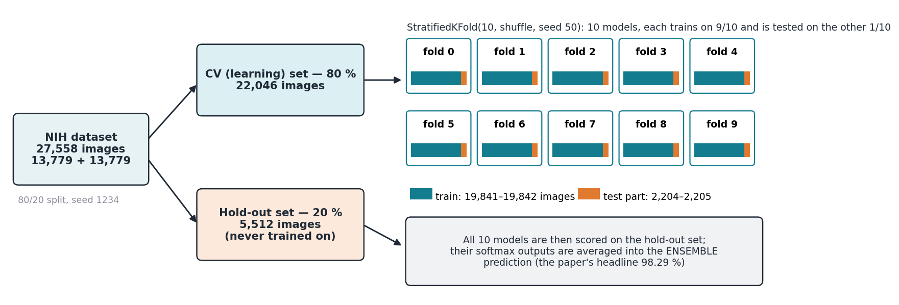

| Set | Size | Used for |
|---|---|---|
| CV (learning) set — 80 % | 22,046 (11,049 parasitized / 10,997 uninfected) | 10-fold cross-validation: training + per-fold testing |
| Hold-out set — 20 % | 5,512 (2,730 / 2,782) | Never trained on; scores every fold model and the ensemble |
| Each fold, training part | 19,841 or 19,842 | Training one of the 10 models |
| Each fold, test part | 2,205 or 2,204 | Choosing the best epoch (validation loss) and the paper's Table 5 |

> 💡 **What is a hold-out set?** Images locked away at the start and used only at the very end, so the final score is on data the model never influenced.
>
> 💡 **What is k-fold cross-validation / a fold?** Cut the learning set into 10 equal slices. Train model 1 on slices 2–10 and test it on slice 1; train model 2 on slices 1, 3–10 and test on slice 2; and so on. Every image is tested exactly once, and we get 10 models and 10 scores (a mean and a spread).
>
> 💡 **What does stratified mean?** Each slice keeps the same parasitized/uninfected ratio as the whole set.
>
> 💡 **What is data leakage?** When information about the test set sneaks into training, making the test look easier than real life. Here: cells from the same slide in both training and testing.

---

## 2. The model and its parameters

> **In one sentence:** EfficientNet-B0 — a compact image network already trained on millions of photos — with a small 4-layer classifier on top, 4,223,934 parameters in total, all of them fine-tuned on malaria cells.

| | |
|---|---|
| **Backbone** | EfficientNet-B0 from the `efficientnet` 1.1.1 package (the one the paper used), **noisy-student** pretrained weights |
| **Head** | Global average pooling → Dense 128 (ReLU) → Dropout 0.3 → Dense 64 (ReLU) → Dropout 0.3 → Dense 32 (ReLU) → Dropout 0.3 → Dense 2 (softmax) |
| **Input → output** | 224 × 224 × 3 image → two probabilities that add up to 1: P(parasitized), P(uninfected) |
| **Trainable?** | Everything (the paper fine-tunes the whole network) |

> 💡 **What is transfer learning?** Start from a network that already learned general visual features (edges, textures, shapes) on a huge dataset, then train it a little more on our task. It needs far less data and time than learning from scratch.
>
> 💡 **What is ImageNet?** A public collection of about 1.3 million everyday photos in 1,000 classes; the standard dataset for pre-training image networks.
>
> 💡 **What are noisy-student weights?** A stronger ImageNet training recipe from Google (2020): a "teacher" network labels 300 million extra unlabelled photos, a "student" learns from them with added noise (dropout, augmentation), and the process repeats. The resulting weights transfer better than the plain ImageNet ones. The paper's code uses them.

### Parameter count (matches the paper's Table 2 exactly)

| Part | Parameters | Trainable | Non-trainable |
|---|---:|---:|---:|
| EfficientNet-B0 backbone | 4,049,564 | 4,007,548 | 42,016 |
| Head: Dense 1280 → 128 | 163,968 | 163,968 | 0 |
| Head: Dense 128 → 64 | 8,256 | 8,256 | 0 |
| Head: Dense 64 → 32 | 2,080 | 2,080 | 0 |
| Head: Dense 32 → 2 | 66 | 66 | 0 |
| **Total** | **4,223,934** | **4,181,918** | **42,016** |

The 42,016 non-trainable numbers are batch-normalisation running statistics (averages the network keeps for inference), not learned by gradient descent.

> 💡 **What is a parameter?** One number the network learns (a weight or a bias). 4.2 million parameters is small: ResNet-50 has about 25 million, VGG-16 about 138 million.

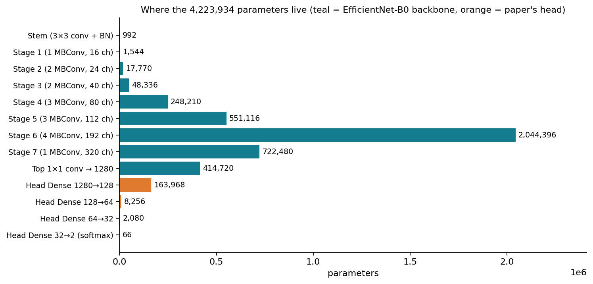

### Layer counts

| What | Count |
|---|---:|
| MBConv blocks (EfficientNet's building block) | **16**, in 7 stages |
| Convolution layers | **81** (65 normal + 16 depthwise) |
| Batch-normalisation layers | 49 |
| Residual (skip) connections | 9 |
| Keras layers in the backbone (every operation counted) | 230 |
| Dense (fully connected) layers in the head | 4 |
| Layers that hold weights (conv + dense) | 85 |

---

## 3. Feature engineering

> **In one sentence:** we do **no hand-crafted feature engineering** — the CNN learns its own features from pixels; we only resize, scale and randomly augment the images, exactly as the paper did.

Older malaria systems computed features by hand (cell area, colour histograms, texture statistics) and fed them to an SVM or random forest. A convolutional network learns those features itself: early layers learn edges and colour blobs, middle layers parasite-like rings and dots, late layers whole-cell patterns.

**What we do to every image:**

| Step | What | Why |
|---|---|---|
| 1. Read | `cv2.imread` + BGR → RGB | Same library and call as the paper's `ImageDataAugmentor` |
| 2. Resize | to 224 × 224, **nearest neighbour** | EfficientNet-B0's native input size; nearest neighbour is the paper's default |
| 3. Augment (training, and — like the paper — also when evaluating) | random rotations, flips, noise, blur, distortions, contrast changes | Teaches the model that a cell is the same cell from any angle or under any stain |
| 4. Scale | pixel ÷ 255 → values 0–1 | The paper's `rescale=1/255` |

**The paper's augmentation pipeline** (copied verbatim from its supplementary code; `albumentations` 0.5.2):

```python
Compose([RandomRotate90(),                                    # 0/90/180/270 degrees
         Flip(),                                              # horizontal / vertical
         Transpose(),                                         # swap rows and columns
         OneOf([IAAAdditiveGaussianNoise(), GaussNoise()], p=0.2),
         OneOf([MotionBlur(p=.2), MedianBlur(blur_limit=3, p=.1), Blur(blur_limit=3, p=.1)], p=0.3),
         ShiftScaleRotate(shift_limit=0.0625, scale_limit=0.2, rotate_limit=45, p=.2),
         OneOf([OpticalDistortion(p=0.3), GridDistortion(p=.1), IAAPiecewiseAffine(p=0.3)], p=0.3),
         OneOf([CLAHE(clip_limit=2), IAASharpen(), IAAEmboss(), RandomContrast(), RandomBrightness()], p=0.3),
         ], p=1)
```

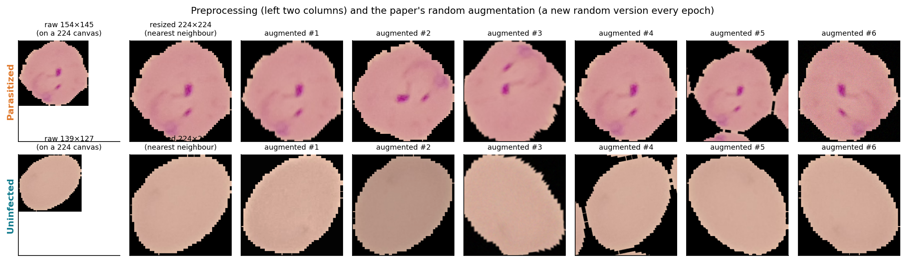

> 💡 **What is data augmentation?** Making many slightly different copies of each training image (rotated, flipped, blurred, re-coloured) on the fly, so the model sees a new version every epoch. It is cheap extra data and reduces overfitting. Every transform here keeps the label: a rotated infected cell is still infected.

**Not used in the baseline:** YUV colour conversion + histogram equalisation (stain normalisation). That is our hypothesis **H2** (section 7) and will be switched on only in experiments A2 and A3.

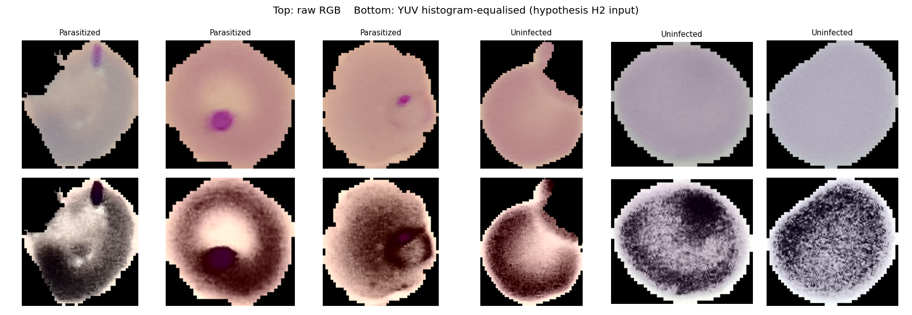

---

## 4. Architecture and training, in depth

> **In one sentence:** the image flows through a stem convolution and 16 MBConv blocks that shrink it from 224 × 224 to 7 × 7 while growing from 3 to 1,280 channels; a small dense head turns those 1,280 numbers into two probabilities; ten such models are trained on ten folds and averaged.

### 4.1 EfficientNet-B0, layer by layer

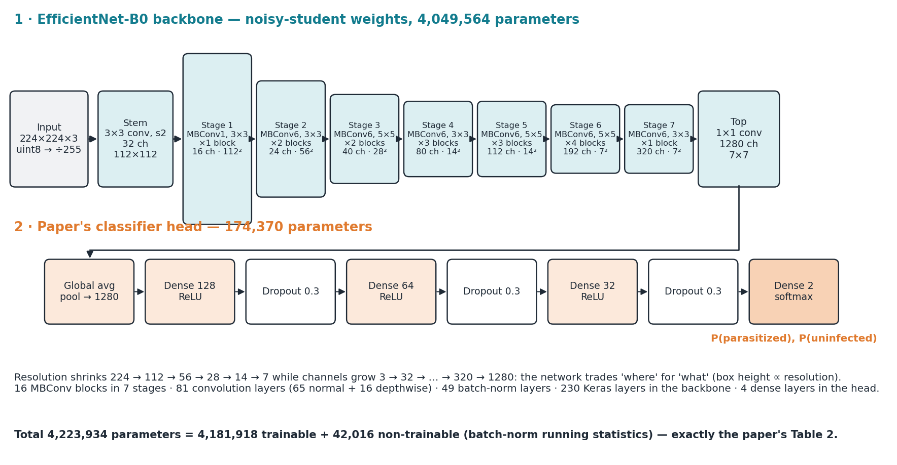

| Stage | Block | Repeats | Kernel | Stride | Output channels | Output size | Parameters |
|---|---|---:|---:|---:|---:|---:|---:|
| Stem | 3 × 3 conv | 1 | 3 | 2 | 32 | 112 × 112 | 992 |
| 1 | MBConv1 | 1 | 3 | 1 | 16 | 112 × 112 | 1,544 |
| 2 | MBConv6 | 2 | 3 | 2 | 24 | 56 × 56 | 17,770 |
| 3 | MBConv6 | 2 | 5 | 2 | 40 | 28 × 28 | 48,336 |
| 4 | MBConv6 | 3 | 3 | 2 | 80 | 14 × 14 | 248,210 |
| 5 | MBConv6 | 3 | 5 | 1 | 112 | 14 × 14 | 551,116 |
| 6 | MBConv6 | 4 | 5 | 2 | 192 | 7 × 7 | 2,044,396 |
| 7 | MBConv6 | 1 | 3 | 1 | 320 | 7 × 7 | 722,480 |
| Top | 1 × 1 conv | 1 | 1 | 1 | 1,280 | 7 × 7 | 414,720 |

**Reading the table:** each stride-2 stage halves the image size; channels (the number of "feature detectors") grow. By the end, every one of the 7 × 7 positions describes a large region of the cell with 1,280 numbers. Global average pooling averages the 49 positions into one 1,280-number summary of the whole cell.

> 💡 **What is a convolution?** A small filter (for example 3 × 3 pixels) slid across the image; at each position it outputs one number saying "how much does this patch look like my pattern?". A layer has many filters, one per output channel.
>
> 💡 **What is a receptive field?** The patch of the original image that one output number "sees". Stacking layers and striding grows it; at the 7 × 7 stage each number sees most of the cell, which is what lets the network notice a parasite anywhere inside it.

**One MBConv block** (MBConv6 = expansion factor 6):

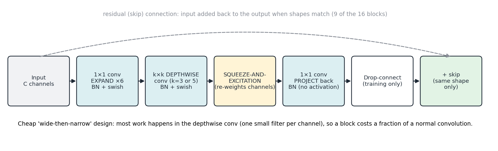

> 💡 **What is a depthwise convolution?** A convolution that filters each channel separately (one small filter per channel) instead of mixing all channels at every position. Together with the 1 × 1 convolutions around it, it does the job of a normal 3 × 3 convolution for about 8–9 times less computation, which is why EfficientNet is small.
>
> 💡 **What is squeeze-and-excitation (SE)?** A mini-network inside each block that looks at the whole feature map (squeeze: average each channel to one number), decides which channels matter for this image (excitation: two tiny dense layers + sigmoid), and re-weights the channels. It lets the block focus on "purple-dot" channels when they are present.
>
> 💡 **What is swish?** The activation function EfficientNet uses: swish(x) = x · sigmoid(x). Like ReLU but smooth, which trains slightly better in deep networks.
>
> 💡 **What is drop-connect?** During training, randomly skips a whole block's output for some images (the skip connection still carries the input). A regulariser for deep networks; off at test time.
>
> 💡 **What is batch normalisation (BN)?** Re-centres and re-scales each channel's values using statistics of the current batch, so every layer receives inputs on a stable scale. Makes training faster and more stable.
>
> 💡 **What is a residual (skip) connection?** Adding a block's input back to its output, so the block only has to learn a correction. Lets gradients flow through deep networks.

**The head:**

> 💡 **What is global average pooling (GAP)?** Averages each of the 1,280 channels over the 7 × 7 grid → 1,280 numbers. No parameters, and it ignores where in the image a feature was.
>
> 💡 **What is a dense (fully connected) layer?** Every input is connected to every output with its own weight: Dense 128 maps 1,280 numbers to 128 numbers using 1,280 × 128 weights + 128 biases = 163,968 parameters.
>
> 💡 **What is ReLU?** The activation max(0, x): keeps positive values, zeroes negatives. Gives the network its non-linearity.
>
> 💡 **What is dropout?** During training, randomly sets 30 % of a layer's outputs to zero, so the network cannot rely on any single neuron. Off at test time. Fights overfitting.
>
> 💡 **What is softmax?** Turns the final 2 numbers into 2 probabilities that sum to 1. The class with the larger probability is the prediction.

**Why B0 and not a bigger model?** EfficientNet scales one base network (B0) up to B7 by growing depth, width and image resolution together ("compound scaling"). B0 is the smallest: 4.2 M parameters, 224 × 224 input, about 0.39 billion operations per image. Cell crops are small (median 130 px) and simple, so bigger versions mostly add cost. The paper chose B0 for this reason, and it is the version that could later run on a phone.

> 💡 **What is compound scaling?** Instead of making a network only deeper (more layers) or only wider (more channels), EfficientNet grows depth, width and input resolution together by fixed ratios. B0 is the baseline; B1–B7 are scaled-up copies.

### 4.2 The training recipe (from the paper's code)

| Setting | Value | Plain meaning |
|---|---|---|
| Loss | categorical cross-entropy with **label smoothing 0.1** | Penalises wrong and over-confident predictions; targets are 0.95/0.05 instead of 1/0 |
| Optimiser | Adam, learning rate 1 × 10⁻⁴ | Standard adaptive gradient descent with small steps (good for fine-tuning) |
| LR schedule | ReduceLROnPlateau: halve the LR when validation loss has not improved for 6 epochs, never below 1 × 10⁻⁶ | Take smaller steps once progress stalls |
| Batch size | 16 images | Images processed together before each weight update |
| Epochs | 33 per fold, no early stopping | 33 full passes over the training part |
| Steps | 1,240 per epoch (19,841 ÷ 16) → 40,920 per fold → 409,200 for all 10 folds | One step = one batch = one weight update |
| Checkpoint | Keep the weights from the epoch with the lowest validation loss | The final model is the best epoch, not the last one |
| Validation during training | The fold's test part (2,205 images), augmented like the paper | Drives the LR schedule and the checkpoint |

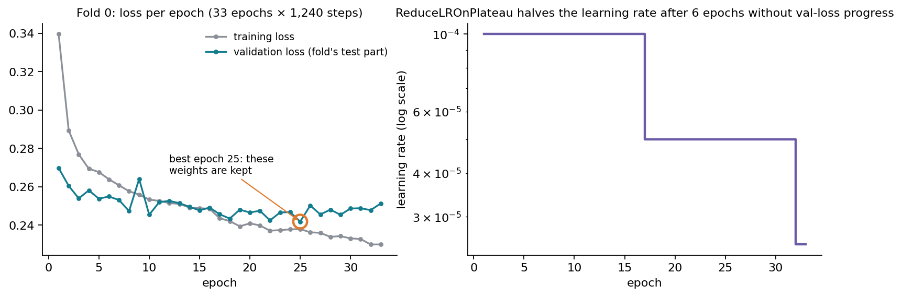

In fold 0 the learning rate was halved twice (10⁻⁴ → 5 × 10⁻⁵ → 2.5 × 10⁻⁵) and the best validation loss came at epoch 25, so those weights were kept.

> 💡 **What is cross-entropy loss?** −log(probability given to the correct class). Confident and right → near 0; confident and wrong → large. Training minimises its average.
>
> 💡 **What is label smoothing?** Instead of asking the network for exactly 100 % "parasitized", ask for 95 % (and 5 % for the other class). Stops it from becoming over-confident and usually generalises a little better.
>
> 💡 **What is Adam?** An optimiser that adapts the step size for every parameter from the history of its gradients. Robust default choice.
>
> 💡 **What is the learning rate?** How big a step the optimiser takes each update. Too big: training jumps around; too small: training crawls.
>
> 💡 **What is an epoch / a step / a batch?** A batch is the group of 16 images processed together; a step is one weight update on one batch; an epoch is one full pass over the training data (1,240 steps here).
>
> 💡 **What is a checkpoint?** A saved copy of the weights. We save one each time the validation loss improves and reload the best one at the end.

### 4.3 The ensemble

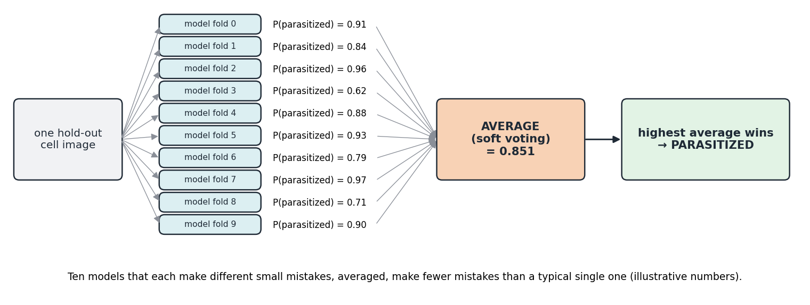

The 10 fold models each predict every hold-out image; their softmax probabilities are **averaged** and the larger average wins. No extra training is needed. In our run the ensemble is 0.25 pp more accurate than the average single model (paper: 0.60 pp).

> 💡 **What is soft voting?** Averaging the models' probabilities (rather than counting their yes/no votes). A model that is 97 % sure counts more than one that is 55 % sure.

### 4.4 Making it fast: the GPU and cloud engineering

The paper trained on a laptop GTX 1050: **4 h 46 min per fold on average, 1 day 23 h 39 min in total.** We ran the same maths on RunPod cloud GPUs:

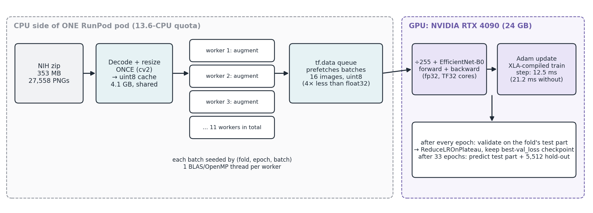

| Problem we hit | What we did | Effect |
|---|---|---|
| 10 folds one after another is slow | **10 RunPod pods in parallel**, one RTX 4090 per fold, launched and collected by `src/runpod_10fold.py` | All folds finish in about the time of one |
| Re-reading 27,558 PNGs every epoch | Decode and resize **once** into a 4.1 GB uint8 array shared by all processes | No PNG decoding during training |
| The paper's augmentation runs on the CPU and is slow | A pool of **11 worker processes** builds batches in parallel, each batch seeded by (fold, epoch, batch) so results don't depend on the number of workers | CPU keeps the GPU fed |
| A "16 vCPU" pod only allows **13.6 CPUs** (container quota), but Python sees 32–64 | Size the pool from the real quota (cgroup), not `os.cpu_count()` | No over-subscription |
| Each worker started its own many-threaded maths library | **One BLAS/OpenMP thread per worker** | Augmentation **957 → 2,884 images/s (3×)** |
| At batch 16 the GPU spends most time launching tiny kernels | **XLA-compile** the training step (fuses many small operations) | **21.2 → 12.5 ms per step (1.7×)** |
| Sending float32 images to the GPU | Send **uint8** (4× smaller) and divide by 255 on the GPU, inside the model | Less data over PCIe; same numbers |
| Speed tricks can change results | Keep **fp32** maths (no mixed precision), same libraries and versions as the paper | Faithful reproduction |

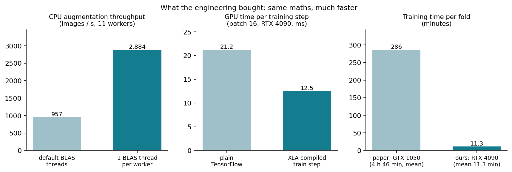

**Result:** about 19 s per epoch and about **11 minutes per fold** (mean 11.3, median 10.8; one slower host took 16.6 min) — about 25× faster per fold than the paper's 4 h 46 min, with the same recipe.

> 💡 **What is a GPU / CUDA / cuDNN?** A GPU runs thousands of small calculations at once. CUDA is NVIDIA's programming platform for GPUs; cuDNN is NVIDIA's library of fast deep-learning operations (convolutions etc.) that TensorFlow calls.
>
> 💡 **What is a kernel launch?** Each GPU operation (one convolution, one addition) is a "kernel" that the CPU has to start. Starting one costs a few microseconds; with small batches the GPU can spend more time waiting for launches than computing.
>
> 💡 **What is XLA?** TensorFlow's compiler (Accelerated Linear Algebra). It looks at the whole training step and fuses many small operations into a few big GPU kernels, so there are far fewer launches. The maths stays the same.
>
> 💡 **What are fp32, TF32 and mixed precision?** fp32 = standard 32-bit floating-point numbers (what the paper used). TF32 = a format NVIDIA tensor cores use inside matrix multiplications (keeps fp32's range with slightly less precision; TensorFlow enables it by default on modern GPUs). Mixed precision = doing most maths in 16-bit for speed; we did **not** use it, to stay faithful.
>
> 💡 **What is a vCPU and a cgroup quota?** A vCPU is one CPU thread a cloud provider gives you. Containers are limited by a "cgroup" quota (here 13.6 CPUs) even though the operating system shows all the host's CPUs; using more threads than the quota just makes them wait.
>
> 💡 **What are BLAS / OpenMP threads?** BLAS is the low-level maths library NumPy and SciPy use; OpenMP is how it runs on several threads. By default each process starts one thread per visible CPU — with 11 processes on 13.6 CPUs that meant hundreds of threads fighting each other.
>
> 💡 **What is RunPod?** A cloud service that rents GPU machines by the hour. Each "pod" is a container on one machine with its own GPU, CPUs and disk.

---

## 5. Code walkthrough

> **In one sentence:** one Python module (`src/marques2022_exact.py`) holds the paper's recipe, a notebook runs it, a launcher runs the notebook on 10 cloud GPUs, and 32 tests prove the recipe matches the paper.

### 5.1 Repository map

| File | What it does |
|---|---|
| `notebooks/Phase2_A0_10fold_PaperExact.ipynb` | The paper-exact 10-fold notebook: data → augmentation → model → training → the paper's tables |
| `notebooks/Phase2_A0_10fold_PaperExact_executed.ipynb` | The same notebook with all results, tables and plots |
| `src/marques2022_exact.py` | The recipe as functions (data, split, augmentation, batches, model, training, metrics, aggregation) |
| `src/runpod_10fold.py` | Creates the RunPod pods, installs the environment, starts training, copies results back, terminates pods |
| `src/runpod_requirements.txt` | The exact library versions (TensorFlow 2.15, efficientnet 1.1.1, albumentations 0.5.2, numpy 1.23.5, …) |
| `tests/test_marques2022_exact.py` | 32 automated checks against the paper and its code |
| `results/A0_10fold_paper/` | Per-fold outputs, summary JSON, CSV tables, plots, logs |
| `notebooks/Phase2_Baseline_Reproduction_Marques2022.ipynb`, `src/phase2_baseline_marques2022.py` | Our first (3-fold, paper-text) reproduction and the A1–A3 hypothesis switches |
| `src/check_results.py`, `src/compare_experiments.py` | Print one experiment vs. the paper; put A0–A3 side by side |

### 5.2 `src/marques2022_exact.py`, function by function

**The recipe in one dictionary** — every value is taken from the paper's code:

```python
PAPER = dict(SEED=1234, KFOLD=10, KFOLD_SEED=50, EPOCHS=33, BATCH_SIZE=16, IMG_SIZE=224,
             LR=1e-4, LR_FACTOR=0.5, PATIENCE=6, MIN_LR=1e-6, LABEL_SMOOTHING=0.1,
             VAL_FRACTION=0.2, WEIGHTS="noisy-student", DENSE=(128, 64, 32), DROPOUT=0.3)
```

#### Data and splits

```python
def build_index(entries, root=None):
    df = pd.DataFrame(list(entries), columns=["file", "label"])
    df = df[df["file"].str.lower().str.endswith(IMAGE_EXTENSIONS)]  # drops Thumbs.db
    df = df.sort_values(["label", "file"]).reset_index(drop=True)   # same order on every machine
    df["cache_idx"] = np.arange(len(df))                            # row in the image cache
    ...

def paper_split(df, seed=PAPER["SEED"]):
    learn, val = train_test_split(df, test_size=0.2, random_state=seed)
    return learn.reset_index(drop=True), val.reset_index(drop=True)

def paper_folds(learn, n_splits=10, seed=50):
    kf = StratifiedKFold(n_splits, shuffle=True, random_state=seed)
    return list(kf.split(learn, learn["label"]))
```

- **`build_index`** makes the table of all images (file, label, path). It removes non-image files and **sorts** the list, because folder listing order differs between computers and would otherwise give each pod a different split.
- **`paper_split`** is the paper's 80/20 split. The paper gave no seed; we fix seed 1234 so all 10 pods get the same split.
- **`paper_folds`** is the paper's stratified 10-fold split (seed 50, as in its code).
- **`split_fingerprint`** (not shown) hashes the split. Every fold saves it, and the final step refuses to combine folds trained on different splits.

#### Images and augmentation

```python
def load_resized(path, size=224):
    img = cv2.cvtColor(cv2.imread(path), cv2.COLOR_BGR2RGB)
    if img.shape[0:2] != (size, size):
        img = cv2.resize(img, dsize=(size, size), interpolation=cv2.INTER_NEAREST)
    return img

def build_image_cache(paths, cache_path, workers=None, size=224):
    np.lib.format.open_memmap(cache_path, mode="w+", dtype=np.uint8, shape=(len(paths), size, size, 3))
    ...  # worker processes decode chunks of 256 images straight into the file
```

- **`load_resized`** reads and resizes one image exactly like the paper's `ImageDataAugmentor` (a test compares the two pixel for pixel).
- **`build_image_cache`** decodes all 27,558 images once into one 4.1 GB uint8 file on disk that every process can read (2 seconds with 13 processes).
- **`build_paper_augmentation`** returns the paper's `Compose` shown in section 3 (a test compares it with a verbatim copy).

```python
def _make_batch(task, state=None):
    rows, seed, augment = task
    cache = (state or _WORKER)["cache"]
    if not augment:
        return np.asarray(cache[rows])
    random.seed(seed); np.random.seed(seed % 2**32); imgaug.random.seed(seed % 2**32)
    out = np.empty((len(rows),) + cache.shape[1:], np.uint8)
    for j, r in enumerate(rows):
        out[j] = state["aug"](image=np.array(cache[r]))["image"]
    return out
```

- **`AugmentPool`** starts the worker processes (with one BLAS thread each) that run **`_make_batch`**.
- **`_make_batch`** builds one batch of 16 images. With augmentation, it first seeds every random generator the paper's pipeline uses from a seed made of (fold, epoch, batch number), so a batch is identical no matter which worker builds it.
- **`iterate_batches`** shuffles the indices for the epoch, cuts them into batches, keeps several batches "in flight" in the pool, and yields them in order.
- **`BatchStream`** + **`as_dataset`** wrap that into a `tf.data` pipeline. Each call is one epoch, so Keras gets a fresh shuffle and fresh augmentations every epoch.
- **`available_cpus`** reads the container's real CPU quota (cgroup v1 and v2) to size the pool.

#### The model

```python
def build_model(weights="noisy-student", size=224):
    base = efn.EfficientNetB0(weights=weights, include_top=False, input_shape=(size, size, 3), **keras_modules)
    inp = layers.Input((size, size, 3), dtype="uint8")
    x = layers.Rescaling(1 / 255)(inp)                      # = ImageDataAugmentor(rescale=1/255)
    x = layers.GlobalAveragePooling2D()(base(x))
    for units in (128, 64, 32):
        x = layers.Dense(units, activation="relu")(x)
        x = layers.Dropout(0.3)(x)
    out = layers.Dense(2, activation="softmax")(x)
    return tf.keras.Model(inputs=inp, outputs=out)

def paper_loss(y_true, y_pred):
    return tf.keras.losses.categorical_crossentropy(y_true, y_pred, label_smoothing=0.1)

def paper_callbacks(weights_path):
    return [ReduceLROnPlateau(monitor="val_loss", factor=0.5, patience=6, min_lr=1e-6),
            ModelCheckpoint(weights_path, save_best_only=True, monitor="val_loss", save_weights_only=True)]
```

- **`build_model`** is the paper's `create_model()`: EfficientNet-B0 without its ImageNet classifier, plus the 128-64-32 head. Its input is uint8 and its first layer divides by 255, so the GPU receives 4× less data.
- **`paper_loss`** is the paper's `custom_loss`.
- **`compile_paper_model`** uses Adam (lr 1e-4, the same optimiser implementation as the paper's TensorFlow 2.3) and the accuracy metric.
- **`paper_callbacks`** halves the learning rate on plateaus and keeps the best weights.
- **`_xla_for_training_only`** is a small callback that turns XLA on while the training step is compiled and off for evaluation, so evaluation's smaller last batch doesn't trigger a slow recompile.

#### One fold, then all folds

```python
def train_fold(fold, *, learn, val, folds, pool, out_dir, xla=True, epochs=33, batch_size=16, ...):
    tr, te = folds[fold]
    model = compile_paper_model(build_model(weights), xla=xla)
    train_stream = BatchStream(pool, rows["train"], ..., augment=True, shuffle=True, drop_remainder=True, ...)
    val_stream   = BatchStream(pool, rows["test"],  ..., augment=True, shuffle=False, ...)   # as the paper
    model.fit(as_dataset(train_stream), epochs=epochs, steps_per_epoch=len(train_stream),
              validation_data=as_dataset(val_stream), callbacks=paper_callbacks(weights_path) + ...)
    model.load_weights(weights_path)                      # the best epoch, as the paper
    for name in ["test_aug", "test_clean", "val_aug", "val_clean"]:
        probs[name] = model.predict(...)                  # test part and hold-out, augmented and clean
    save_fold_outputs(out_dir, record, probs, ...)        # fold_k.json + fold_k_predictions.npz
```

- **`train_fold`** is the body of the paper's training loop for one fold: build, train 33 epochs, reload the best checkpoint, then predict the fold's test part and the hold-out set, both with the paper's augmented images and with clean images. It saves the history, timings, every metric and all predictions.
- **`classification_summary`** reproduces sklearn's `classification_report` (per-class precision/recall/F1, macro and weighted averages) plus the confusion matrix, MCC and ROC-AUC. A test feeds it the paper's own ensemble counts and gets the paper's printed numbers back to 6 decimals.
- **`aggregate`** loads all 10 folds, checks they share one split, rebuilds the paper's Tables 3–6, and averages the 10 models' softmax outputs into the ensemble (paper protocol and clean).
- **`write_results`** writes the CSV/JSON files in the same layout as our first experiment, so `python src/check_results.py results/A0_10fold_paper` works.

### 5.3 The notebook, section by section

| Section | What happens |
|---|---|
| 1 · Parameters | `FOLDS_TO_TRAIN` (e.g. `[3]` on a pod, `[]` to only build tables), data/output paths, `XLA`, `SMOKE` (5 % of the data, 2 short epochs) |
| 2 · Data and split | Download/locate NIH, index, split; prints our sizes next to the paper's |
| 3 · Augmentation | Prints the paper's `Compose`; shows augmented examples |
| 4 · Model | Builds the model; parameter table vs. the paper's Table 2 |
| 5 · Training | Builds the image cache, starts the worker pool, trains each requested fold; prints accuracy and the classification report exactly like the paper's notebook |
| 6 · Results | Tables 3–6, the ensemble report, ours vs. paper, the figures |
| 7–8 · Notes and conclusion | What is identical to the paper, what differs and why |

### 5.4 `src/runpod_10fold.py` — the cloud launcher

```bash
python src/runpod_10fold.py up --folds 0 --setup-only   # one "canary" pod: install + check the GPU first
python src/runpod_10fold.py go --folds 0-9              # set up and start every pod the moment it is ready
python src/runpod_10fold.py status                      # stage of every pod + money spent so far
python src/runpod_10fold.py watch                       # copy each finished fold home, terminate its pod
python src/runpod_10fold.py down                        # terminate everything (safety)
```

It talks to RunPod's REST API (API key from `~/.runpod_key`), asks for RTX 4090s with at least 16 vCPUs (preferring the EU-RO-1 data centre), installs the pinned environment with `uv`, uploads the notebook and module over SSH, runs the notebook with `papermill` (one fold per pod), and keeps a spending cap. Each pod also starts a 2-hour watchdog that tries to remove the pod if the laptop disconnects.

### 5.5 What the 32 tests prove

| Group | Tests | What they check against |
|---|---:|---|
| Recipe | 2 | Every hyper-parameter equals the paper's code; class order |
| Splits | 4 | 22,046 / 5,512 split; fold sizes 19,841–19,842 / 2,204–2,205 as printed in the paper's output; order-independence; stratification |
| Augmentation and images | 7 | `Compose` identical to a verbatim copy; pixels identical to the paper's `ImageDataAugmentor`; reproducible batches for any number of workers; new augmentations every epoch; 1,240 steps per epoch |
| Model | 6 | **4,223,934 / 4,181,918 / 42,016 parameters** (Table 2); the head layer by layer; ÷255 input; label-smoothed loss; Adam 1e-4; callbacks |
| Metrics | 4 | The paper's ensemble report and Table 5 reproduced to 6 decimals from its own confusion counts; AUC; ensemble = mean of softmax |
| End to end | 1 | A real (tiny) training run restores the best checkpoint and saves every output |
| Aggregation | 4 | Ensemble = mean of saved probabilities; refuses mixed splits; compares with the paper's true precision/recall; output readable by `check_results.py` |
| Infrastructure | 4 | CPU quota (cgroup v1 and v2); file names load back without pickle; one BLAS thread per worker |

Run them with `python -m pytest tests/ -q` (needs the environment in `src/runpod_requirements.txt`).

---

## 6. How we evaluate: folds, ensemble, metrics

> **In one sentence:** we train 10 models on 10 different 90 % slices of the data (10-fold cross-validation), let them vote as one ensemble, and score everything by counting four kinds of answers (caught, missed, false alarm, correct all-clear); every metric is a different ratio of those four counts.

### 6.1 Train, test and hold-out: who sees which images

| Set | Size | Used for | Analogy |
|---|---|---|---|
| **Train part** of a fold | 19,841–19,842 | the model learns from these | the textbook |
| **Test part** of a fold | 2,204–2,205 | checked after every epoch; picks the best epoch and lowers the learning rate | mock exams |
| **Hold-out set** | 5,512 (20 %) | never touched in training; the final score of every model and of the ensemble | the final exam |

> 💡 **The paper's words.** The paper calls the hold-out set the *validation* set and the fold's test part the *test* set. Many courses use the opposite names, so always say which one you mean.

### 6.2 What a "fold" is: 1 fold, 2-fold, 10-fold

**k-fold cross-validation** cuts the learning set (22,046 images) into *k* equal parts. You then train *k* models: model *i* learns from every part **except** part *i* and is tested on part *i*. Every image is tested exactly once and used for training *k − 1* times.

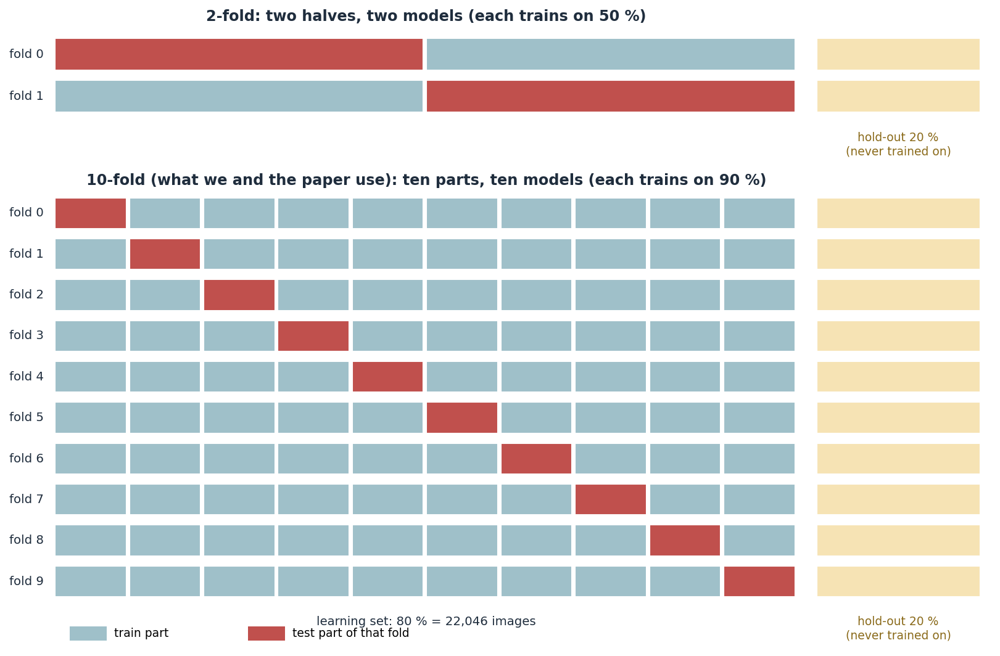

| Phrase | What it means here |
|---|---|
| **"a fold"** / **"fold 3"** | One round of the procedure: one model trained on 9 of the 10 parts and tested on the remaining part (part 3). We number them 0–9 like the paper's code. "Fold 3 took 16.6 min" = that round's training time. |
| **2-fold** | Two halves: train on half A, test on half B, then the other way round. Two models, each trained on only 50 % of the data, so each is weaker. |
| **10-fold** (ours, the paper's) | Ten parts, ten models, each trained on 90 % of the data. More training data per model and ten test scores instead of two. |
| **"1-fold"** | Not real cross-validation (k must be at least 2). People mean a single train/test split, which gives one score and no idea of the spread. |
| **"3 of 10 folds"** | Our first run: the data was cut into 10 parts, but only 3 of the 10 rounds were trained (Kaggle time limit), so 3 models. |
| **Stratified** | Every part keeps the class balance (about 50 % parasitized), so no fold is accidentally easier. |
| **97.55 ± 0.30 %** | The mean of the 10 test-part accuracies, ± their standard deviation: folds differ from each other by about 0.3 pp. |

### 6.3 The ensemble: ten models voting as one

For each hold-out cell, every fold model outputs a probability that it is parasitized. The **ensemble averages the ten probabilities** (called *soft voting*) and says "parasitized" when the average is at least 0.5. No extra training is needed: the ten models already exist.

| | Model 0 | Model 1 | Model 2 | … | Model 9 | **Average** | Decision |
|---|---|---|---|---|---|---|---|
| A hard cell (example) | 0.62 | 0.41 | 0.58 | … | 0.47 | **0.53** | parasitized |

Each model makes slightly different mistakes, because each saw a different 90 % of the data; averaging cancels part of them. Ours: the average single model scores **97.37 %** on the hold-out set, the ensemble **97.62 %** (+0.25 pp; the paper gained +0.60 pp). *Hard voting* (majority of yes/no answers) is the alternative; averaging probabilities keeps more information.

### 6.4 The confusion matrix: the four boxes behind every metric

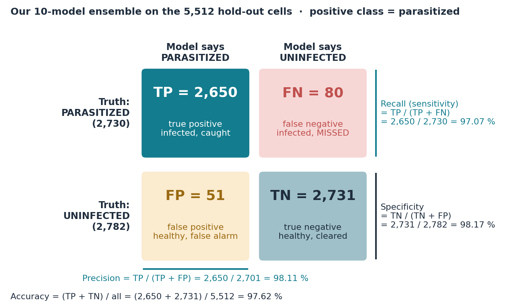

| Box | Name | Plain meaning | Ours |
|---|---|---|---|
| **TP** | true positive | infected cell, model says infected (**caught**) | 2,650 |
| **FN** | false negative | infected cell, model says healthy (**missed**, the dangerous error) | 80 |
| **FP** | false positive | healthy cell, model says infected (**false alarm**) | 51 |
| **TN** | true negative | healthy cell, model says healthy (correct all-clear) | 2,731 |

"Positive" just means "the thing we are looking for" (parasitized). It is not good or bad.

### 6.5 Every metric, worked out with our numbers

| Metric | The question it answers | Formula | Ours (ensemble) | Paper |
|---|---|---|---:|---:|
| **Accuracy** | Of all cells, how many did we get right? | (TP + TN) / all | (2,650 + 2,731) / 5,512 = **97.62 %** | 98.29 % |
| **Precision** | When the model says "parasitized", how often is it right? | TP / (TP + FP) | 2,650 / 2,701 = **98.11 %** | 98.82 % |
| **Recall** (= sensitivity, true-positive rate) | Of all infected cells, how many did we catch? | TP / (TP + FN) | 2,650 / 2,730 = **97.07 %** | 97.74 % |
| **Specificity** (true-negative rate) | Of all healthy cells, how many did we clear? | TN / (TN + FP) | 2,731 / 2,782 = **98.17 %** | 98.84 % |
| **F1** | One number that balances precision and recall | 2·P·R / (P + R) = 2TP / (2TP + FP + FN) | 5,300 / 5,431 = **97.59 %** | 98.28 % |
| **F2** *(not used in the paper; shown to learn)* | Like F1, but recall counts more | 5·P·R / (4·P + R) = 5TP / (5TP + 4FN + FP) | 13,250 / 13,621 = **97.28 %** | 97.95 % |
| **ROC-AUC** | Pick one infected and one healthy cell at random: how often does the infected one get the higher "parasitized" score? | area under the ROC curve | **99.73 %** | 99.76 % |
| **MCC** | How strongly do prediction and truth agree, on a −1 to +1 scale? | (TP·TN − FP·FN) / √((TP+FP)(TP+FN)(TN+FP)(TN+FN)) | **0.95** | 0.97 |

**How to remember them**
- **Recall is about the sick:** of everyone who is sick, how many did we find? Missing them (FN) lowers recall.
- **Precision is about the alarms:** of all the alarms we raised, how many were real? False alarms (FP) lower precision.
- **Specificity is about the healthy:** of everyone who is healthy, how many did we correctly send home?
- **Accuracy** mixes everything. It is fine here because the classes are 50/50, but misleading when one class is rare: if only 1 % of cells were infected, a model that always says "healthy" would score 99 % accuracy and 0 % recall.
- **F1** is the *harmonic* mean of precision and recall, which punishes imbalance: precision 100 % with recall 50 % averages to 75 %, but F1 is only 67 %.
- **F-beta** generalises F1: F_β = (1 + β²)·P·R / (β²·P + R). β = 1 gives F1 (equal weight). β = 2 gives **F2**, where recall weighs more, the usual choice for screening tests where a miss is worse than a false alarm. β = 0.5 gives F0.5, where precision weighs more (ours: 97.90 %). We report F1 because the paper does; F2 is a sensible extra metric for our hypothesis experiments.
- **ROC-AUC** does not depend on the 0.5 threshold: it measures how well the scores *rank* infected above healthy cells. 50 % = coin flip, 100 % = perfect ranking.
- **MCC** uses all four boxes and stays honest even when classes are unbalanced: 0 = no better than chance, 1 = perfect.

> 💡 **Macro vs. weighted average.** The paper's Tables 5 and 6 compute precision, recall and F1 for each class (parasitized and uninfected) and then average the two, weighted by how many cells each class has. With 50/50 classes this weighted average is almost the same as accuracy. Everywhere else (and in our summaries) "precision" and "recall" mean the **parasitized** class.

> 💡 **The paper's swap.** The paper's text says "recall 98.82 %, precision 97.74 %". Its own printed report gives 2,682 caught, 62 missed, 32 false alarms, so recall = 2,682 / 2,744 = 97.74 % and precision = 2,682 / 2,714 = 98.82 %: the two numbers were swapped.

### 6.6 The threshold trade-off

The model gives a probability; we call a cell parasitized when it is at least 0.5. Move that threshold and precision and recall move in opposite directions:

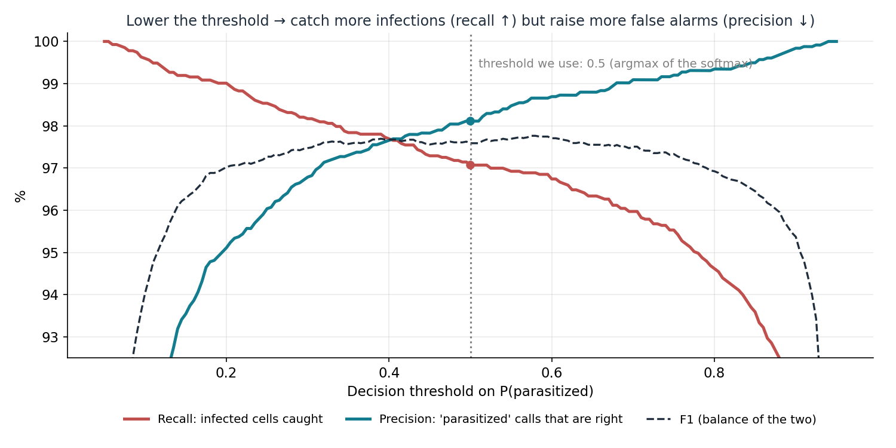

At 0.5 our ensemble has recall 97.07 % and precision 98.11 %. At 0.3 it would catch more infections (recall 98.17 %) but raise more false alarms (precision 96.79 %). For a screening tool you may prefer the lower threshold. We keep 0.5 because the paper does (it takes the larger of the two softmax outputs).

### 6.7 What counts as a "good" value?

There is no universal cut-off: it depends on the cost of each mistake, on chance level, and on what other methods achieve on the same data. For this dataset (two balanced classes, single-cell crops):

| Metric | Chance level | What published work reports | Ours (ensemble) | Verdict |
|---|---|---|---:|---|
| Accuracy | 50 % | 95.9–99.96 % across the 11 studies we reviewed; only one above 99.5 % | 97.62 % | good, inside the published range |
| Recall | 50 % (random guessing) | 82–98.8 % in the paper's comparison table (Table 7); thin-smear models mostly 92–98 % | 97.07 % | good; the metric to push up first (misses are the dangerous error) |
| Precision | 50 % | 89–98.8 % in Table 7 for thin-smear models | 98.11 % | good |
| Specificity | 50 % | rarely reported | 98.17 % | good |
| F1 | about 50 % | 88–98.3 % in Table 7 for thin-smear models | 97.59 % | good |
| ROC-AUC | 50 % | 99.76 % for the paper; rarely reported elsewhere | 99.73 % | excellent |
| MCC | 0 | rarely reported; above 0.9 is very strong agreement | 0.95 | very strong |

**Rules of thumb (not official standards)**
- On this benchmark, above 95 % is solid, around 97–98 % is competitive with published work, and above 99.5 % deserves suspicion: random image splits let cells of the same patient sit in both training and test (hypothesis H1), which can inflate scores.
- In medicine, **recall comes first** (a missed infection can be fatal; a false alarm costs a second look), but precision and specificity must stay high or clinics drown in false alarms.
- A metric only means something next to a baseline: compare with chance, with the paper (here within 1 pp) and with the spread between folds (± 0.3 pp).
- These are **per-cell** numbers. A patient's slide contains hundreds of cells, so the per-patient decision can be more reliable than any single cell's, but we have not measured it; that is a proposed next step.

### 6.8 Talking about differences: pp, %, ± and standard error

| Term | Meaning | Our example |
|---|---|---|
| **pp (percentage points)** | Plain subtraction of two percentages | 97.62 − 98.29 = **−0.67 pp** |
| **% change (relative)** | The difference divided by the reference value | −0.67 / 98.29 = **−0.68 %** |
| **Error-rate view** | The same gap, seen through the mistakes | error 2.38 % vs. 1.71 % → +0.67 pp, but **39 % more errors** in relative terms |
| **± (standard deviation)** | How much the 10 folds differ from each other | 97.55 **± 0.30** % |
| **Standard error (SE)** | How much an accuracy would wobble on another test set of the same size: √(p·(1 − p) / n) | √(0.976 × 0.024 / 5,512) ≈ **0.21 pp**, so our 0.67 pp gap to the paper is about 3 SE: probably not just luck |

"Within 1 pp of the paper" (our success criterion) means every metric differs from the paper's by at most one percentage point.

## 7. Results, improvements and hypotheses

> **In one sentence:** the paper-exact 10-fold reproduction lands within 1 percentage point of the paper on every headline metric (mean fold accuracy 97.55 % vs. 97.56 %), so our baseline is validated; the two hypotheses about slide leakage and stain normalisation are designed and coded but not yet run.

### 7.1 Ours vs. the paper

| Metric | Paper | Ours (paper protocol) | Δ (pp) | Ours (clean images) |
|---|---:|---:|---:|---:|
| Mean CV-fold accuracy (Table 5) | 97.56 | **97.55** ± 0.30 | −0.01 | 97.78 |
| Mean single-model hold-out accuracy (Table 6) | 97.69 | 97.37 | −0.32 | 97.48 |
| Mean single-model hold-out ROC-AUC (Table 6) | 99.65 | 99.52 | −0.13 | 99.52 |
| **Ensemble accuracy** | 98.29 | **97.62** | −0.67 | 97.64 |
| Ensemble recall (parasitized) | 97.74 | 97.07 | −0.67 | 97.18 |
| Ensemble precision (parasitized) | 98.82 | 98.11 | −0.71 | 98.04 |
| Ensemble F1 (parasitized) | 98.28 | 97.59 | −0.69 | 97.61 |
| Ensemble specificity | 98.84 | 98.17 | −0.67 | 98.09 |
| Ensemble ROC-AUC | 99.76 | **99.73** | −0.03 | 99.68 |
| Ensemble MCC | — | 0.95 | — | 0.95 |

On the 5,512 hold-out cells the ensemble **missed 80 of 2,730 infected cells** and **flagged 51 of 2,782 healthy cells** (the paper: 62 and 32).


**How to read it:**

- **Single models match the paper.** The mean fold accuracy is 0.01 pp from the paper, with a fold-to-fold spread of only ±0.30 pp.
- **The ensemble is 0.67 pp lower.** Our ensemble gains +0.25 pp over its average member, the paper's +0.60 pp. The gap is about three standard errors of a 5,512-image test set, so it is probably not only chance. Likely causes: the paper's unseeded split (impossible to recreate), TensorFlow 2.15 instead of 2.3, and different hardware.
- **Augmented vs. clean evaluation barely matters** (97.62 % vs. 97.64 % ensemble), so the paper's unusual choice of augmenting test images does not explain its numbers.
- **Compared with our first reproduction** (3 folds, paper text, Kaggle 2× T4): mean fold accuracy 97.38 ± 0.74 → **97.55 ± 0.30**, ensemble 97.57 % → **97.62 %**, recall 96.81 % → **97.07 %**.

> 💡 **The metrics in plain words** (parasitized = "positive"):
> **Accuracy** — share of all cells classified correctly.
> **Precision** — of the cells we called infected, how many really were (few false alarms → high).
> **Recall / sensitivity** — of the truly infected cells, how many we caught (few missed infections → high). The clinically most important number.
> **Specificity** — of the healthy cells, how many we called healthy.
> **F1** — one number balancing precision and recall (their harmonic mean).
> **ROC-AUC** — the probability that a random infected cell gets a higher "infected" score than a random healthy one; 100 % = perfect ranking, 50 % = coin toss. Independent of the 50 % decision threshold.
> **MCC** (Matthews correlation coefficient) — a balanced score from −1 to +1 that uses all four confusion-matrix cells; robust even when classes are unbalanced.
> **Confusion matrix** — the 2 × 2 table of true vs. predicted class: correct infected, missed infected, false alarms, correct healthy.
> **pp (percentage points)** — the plain difference between two percentages: 97.62 % vs. 98.29 % is −0.67 pp.

### 7.2 What reading the paper's code revealed

The paper's supplementary file is its authors' executed Jupyter notebook. It differs from the paper's text — and from our first reproduction — in eight settings:

| # | Setting | Paper's code (now used) | Our first reproduction |
|---:|---|---|---|
| 1 | Pretrained weights | noisy-student (`efficientnet` 1.1.1) | ImageNet (Keras) |
| 2 | Classifier head | GAP → 128 → 64 → 32 → 2 (softmax), dropout 0.3 | GAP → dropout 0.2 → 1 (sigmoid) |
| 3 | Loss | categorical cross-entropy, label smoothing 0.1 | binary cross-entropy |
| 4 | Schedule | 33 epochs, no early stopping, LR × 0.5 on plateau, best checkpoint | ≤ 15 epochs, early stopping, LR × 0.1 |
| 5 | Batch size | 16 | 128 |
| 6 | Hold-out set | 20 % (5,512 images); folds with seed 50 | 10 %; seed 42 |
| 7 | Augmentation | full albumentations pipeline (section 3) | flips + 90° rotations |
| 8 | Input | nearest-neighbour resize, pixels ÷ 255 | bilinear resize, ImageNet normalisation |

**Two quirks in the paper itself:**

1. **Its code augments the test and hold-out images too** (one augmenting generator feeds training, testing and validation). We kept this for the headline numbers and report clean evaluation alongside.
2. **Its text swaps the ensemble's precision and recall.** It says "recall 98.82 %, precision 97.74 %", but its own printed report (2,744 infected cells, 62 missed; 2,768 healthy, 32 flagged) gives **recall 97.74 %** and **precision 98.82 %**. Our first report said "recall is 2 pp lower than the paper"; against the correct number the gap was 0.9 pp, and it is now 0.67 pp. (Also, Table 6's "accuracy" column is the mean of precision and recall, 97.70 on average; the true mean accuracy in its output is 97.69.)

### 7.3 What is validated, and what is not yet

| Claim | Status | Evidence |
|---|---|---|
| Our code is the paper's recipe | ✅ validated | 32 tests (Table 2 parameters, the paper's printed numbers, verbatim augmentation) |
| We reproduce the paper's results | ✅ validated (A0) | All headline metrics within 1 pp on all 10 folds |
| The ensemble improves on single models | ✅ yes, +0.25 pp | Smaller gain than the paper's +0.60 pp |
| H1: random image splits inflate accuracy (slide leakage) | ⏳ **not yet tested** | Experiment A1 (designed, coded, not run) |
| H2: YUV stain normalisation helps on unseen slides | ⏳ **not yet tested** | Experiments A2 and A3 (designed, coded, not run) |

### 7.4 Our hypotheses and how we test them

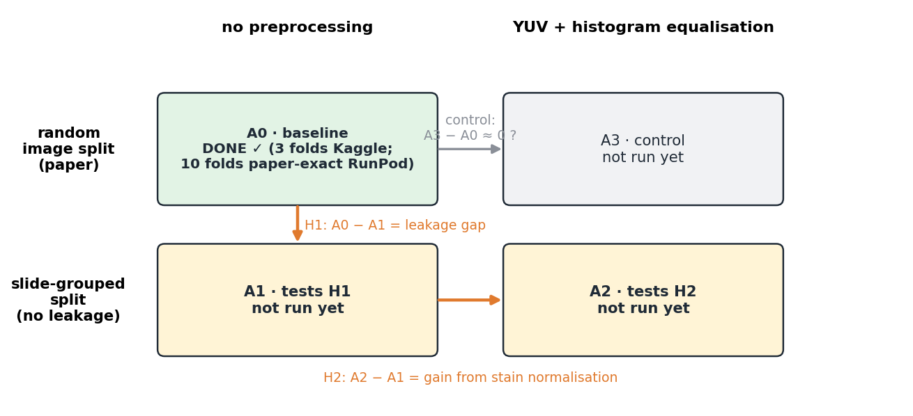

| ID | Split | Preprocessing | Question it answers |
|---|---|---|---|
| A0 | Random image split (paper) | None | Baseline — **done** |
| A1 | Slide-grouped split (no slide in both train and test) | None | **H1:** how big is the leakage gap (A0 − A1)? |
| A2 | Slide-grouped split | YUV + histogram equalisation | **H2:** does stain normalisation help on unseen slides (A2 − A1)? |
| A3 | Random image split | YUV + histogram equalisation | Control: is H2's gain specific to new slides (A3 − A0 ≈ 0)? |

- **H1 — validation.** Cells from one slide share stain, lighting and the patient's cell shape; a random split lets the model recognise the slide rather than the parasite. *We expect* accuracy and MCC to fall below A0 and the fold-to-fold spread to widen.
- **H2 — preprocessing.** Converting to YUV and equalising the brightness channel removes slide-specific colour cues, so the network must rely on parasite shape. *We expect* higher recall and MCC than A1 on unseen slides, and little change on the random split (A3 ≈ A0).

**Success criteria (decided in advance):**

- Each comparison changes exactly one thing; same seeds, epochs and folds.
- Report accuracy, **recall first** (a missed infection costs more than a false alarm), MCC and ROC-AUC, as mean ± SD over folds plus the hold-out ensemble.
- **H2 is rejected** if its gain over A1 is smaller than the fold-to-fold standard deviation.
- **H1 is rejected** (leakage is not a real issue on this dataset) if grouped and random splits score the same.

### 7.5 Proposed next steps *(proposals, not yet done)*

1. **Run A1, A2, A3** with the same parallel RunPod setup: 10 folds each in about 15–20 minutes of wall-clock time and roughly $2 per experiment. The grouped split and the YUV switch already exist in the first notebook; they need to be added to the paper-exact module.
2. **Report per-slide (per-patient) results**, not only per-cell, since a diagnosis is made per patient.
3. **Tune the decision threshold for recall.** Lowering it from 0.5 trades a few false alarms for fewer missed infections; choose it on the CV folds, report it on the hold-out set.
4. **Check calibration** (does "90 % sure" mean right 90 % of the time?) with a reliability diagram.
5. **Explain predictions** with Grad-CAM heat maps to show the model looks at the parasite, not the background or stain.
6. **Make it phone-sized**: distil the 10-model ensemble into one model and quantise it (TensorFlow Lite), then measure speed on a phone.
7. **Test on an external dataset** (a different hospital or microscope) — the real test of H2.

---

## 8. Presentation cheat sheet

**10 numbers to remember**

| Number | Meaning | Number | Meaning |
|---|---|---|---|
| **27,558** | cell images (13,779 per class), 200 slides, 0 duplicates | **97.62 %** | 10-model ensemble accuracy on 5,512 hold-out cells (paper 98.29 %) |
| **4,223,934** | parameters (4,181,918 trainable) — exactly the paper's Table 2 | **99.73 %** | ensemble ROC-AUC (paper 99.76 %) |
| **10 × 33 × 1,240** | folds × epochs × steps of 16 images | **97.07 %** | ensemble recall (paper 97.74 % — its text wrongly says 98.82 %) |
| **97.55 %** | mean fold accuracy (paper 97.56 %) | **80 / 51** | infected cells missed / healthy cells flagged, out of 5,512 |
| **32** | automated tests proving the recipe matches the paper | **≈ 11 min** | per fold on an RTX 4090 (mean 11.3; paper: 4 h 46 min on a GTX 1050) |

**6 sentences**

1. We reproduced Marques et al. (2022) — EfficientNet-B0 with a 10-fold ensemble — exactly as their published code does it, on all 10 folds.
2. Every headline metric is within 1 percentage point of the paper; the mean fold accuracy matches to 0.01 points.
3. Reading their code showed that the paper's text leaves out or differs from the real recipe (weights, head, batch size, epochs, augmentation, hold-out size), and that the paper swaps precision and recall.
4. We made each fold about 26 times faster without changing the maths: decode once, parallel augmentation, XLA, and ten GPUs in parallel.
5. The baseline still splits images at random, so cells from the same patient can be in training and testing — our hypothesis H1 measures that leakage.
6. Next we run A1–A3 to measure the leakage and test whether YUV stain normalisation (H2) recovers accuracy on unseen patients.

**Likely questions and short answers**

| Question | Answer |
|---|---|
| Why EfficientNet-B0? | Best accuracy per parameter of its time; 4.2 M parameters; the paper used it; small enough for a phone later. |
| Why 10 folds and an ensemble? | Every image is tested once, we get a mean and a spread, and averaging 10 models cancels some of their individual mistakes (+0.25 pp here). |
| Why is your ensemble 0.67 pp below the paper? | The paper's random split had no seed and can't be recreated; newer TensorFlow and different GPUs. Single models match to 0.01 pp, and every metric is within our 1 pp criterion. |
| Did you do feature engineering? | No hand-crafted features; the CNN learns them. Only resizing, ÷255 and the paper's random augmentation. YUV stain normalisation is hypothesis H2. |
| Is the dataset clean? | Balanced 50/50, no duplicates, expert labels; we drop two Thumbs.db files. Caveats: Fuhad et al. (2020) found about 5 % mislabelled or doubtful images, and random splits allow slide leakage (H1). |
| Is there data leakage? | Possibly, at slide level: 150 slides have cells in both classes and a random split mixes them. That is exactly what A1 tests. |
| What is label smoothing? | Training targets of 0.95/0.05 instead of 1/0, so the model doesn't become over-confident. It is in the paper's code. |
| How do you know your code matches the paper? | 32 tests: Table 2 parameter count, the paper's printed reports reproduced to 6 decimals, its augmentation verbatim, its image loading pixel for pixel. |
| How did you make it fast without changing results? | Decode once, 11 parallel augmentation workers with single-threaded BLAS (3×), uint8 transfer, XLA (1.7×), 10 GPUs in parallel. Same fp32 maths and library versions. |
| Why focus on recall? | A missed infection (false negative) can be fatal; a false alarm only costs a re-check. We missed 80 of 2,730 infected cells. |
| What would prove your hypotheses wrong? | H1 is rejected if grouped and random splits score the same; H2 is rejected if its gain over A1 is smaller than the fold-to-fold SD. |
| What did the paper get wrong? | It swaps precision and recall in the text, its code augments test images, and several training settings are only in the code. |

---

## 9. Glossary

| Term | Plain meaning |
|---|---|
| Accuracy | Share of all predictions that are correct |
| Adam | Optimiser that adapts each parameter's step size from its gradient history |
| Augmentation | Random, label-preserving changes (rotate, flip, blur…) to training images |
| Batch / step / epoch | 16 images processed together / one weight update / one pass over all training images |
| Batch normalisation | Re-scales each channel to a stable range during training |
| BLAS / OpenMP | Low-level maths library under NumPy / its multi-threading system |
| cgroup quota / vCPU | The CPU limit a container really gets / one virtual CPU thread |
| Checkpoint | Saved copy of the model's weights |
| Compound scaling | Growing depth, width and resolution together (EfficientNet B0 → B7) |
| Confusion matrix | 2 × 2 table of true vs. predicted classes |
| Convolution | A small filter slid over the image, detecting one pattern |
| Cross-entropy | Loss = −log(probability of the correct class) |
| CUDA / cuDNN | NVIDIA's GPU programming platform / its deep-learning operations library |
| Data leakage | Test information sneaking into training, inflating scores |
| Dense layer | Every input connected to every output |
| Depthwise convolution | One filter per channel; much cheaper than a normal convolution |
| Drop-connect | Randomly skipping a block during training |
| Dropout | Randomly zeroing outputs during training (30 % here) |
| Ensemble / soft voting | Combining several models by averaging their probabilities |
| F1 | Harmonic mean of precision and recall |
| Fold / k-fold CV | One of k slices; train on k−1, test on 1, repeat k times |
| fp32 / TF32 / mixed precision | 32-bit floats / tensor-core format for fp32 maths / 16-bit maths for speed (not used) |
| Global average pooling | Averages each channel over the image |
| GPU / kernel launch | Parallel processor / starting one GPU operation |
| Hold-out set | Data kept aside and used only for the final score |
| ImageNet / noisy-student | 1.3 M-photo pre-training dataset / an improved pre-training method using 300 M extra unlabelled photos |
| Label smoothing | Targets 0.95/0.05 instead of 1/0 |
| Learning rate / ReduceLROnPlateau | Step size / halve it when validation loss stalls for 6 epochs |
| MBConv | EfficientNet's block: expand → depthwise conv → squeeze-and-excitation → project (+ skip) |
| MCC | Balanced correlation score from −1 to +1 using all four confusion-matrix cells |
| Parameter | One learned number (weight or bias) |
| pp | Percentage points: the plain difference between two percentages |
| Precision / recall / specificity | Of predicted infected, how many are / of truly infected, how many found / of truly healthy, how many called healthy |
| ReLU / swish / softmax | max(0, x) / x · sigmoid(x) / turns scores into probabilities summing to 1 |
| Residual connection | Adding a block's input to its output |
| ROC-AUC | Probability that an infected cell scores higher than a healthy one |
| RunPod / pod | Cloud GPU rental / one rented container with a GPU |
| Squeeze-and-excitation | In-block mini-network that re-weights channels |
| Stratified | Each slice keeps the overall class ratio |
| Transfer learning | Starting from a network pre-trained on another dataset |
| XLA | TensorFlow's compiler that fuses many GPU operations into few |
