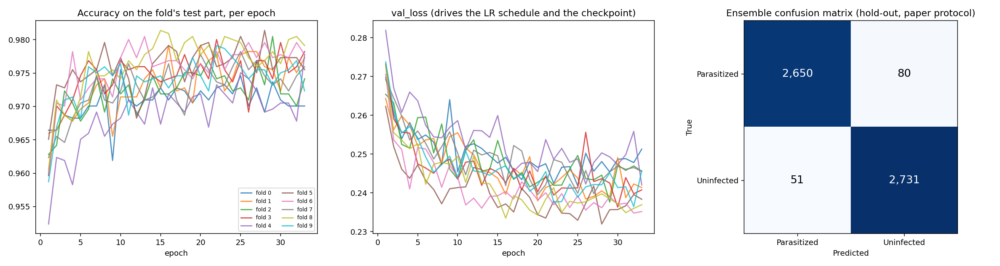

# Phase 2 Report: Automated Malaria Cell Detection

## 1. Introduction

Malaria is diagnosed by looking at Giemsa-stained blood smears under a microscope, where a trained technician checks each red blood cell for parasites. This works, but it is slow (each slide holds hundreds of cells), it depends on scarce expert skill (especially in the rural regions where malaria is common), and results vary between observers and labs.

Our goal is an automated deep-learning system that classifies single red-blood-cell images as **parasitized** or **uninfected**, accurately and consistently, and light enough to eventually run at the point of care.

Phase 1 surveyed 11 published studies. In Phase 2 (this report) we reproduce the strongest-documented one, Marques et al. (2022), as our baseline, then test whether its accuracy holds up once slide-level leakage is removed.

## 2. Baseline reproduction (Marques et al., 2022)

**Goal.** Rebuild the paper's model on the same data and check we land within about 1 percentage point of its reported results. This becomes our Phase 2 baseline (experiment A0).

**Method.**
- Data: NIH malaria cell images, 27,558 cells (13,779 parasitized, 13,779 uninfected), Kaggle mirror.
- Model: EfficientNet-B0 pretrained on ImageNet, 224 × 224 input, dropout 0.2.
- Training: Adam (lr 1e-4), ReduceLROnPlateau (patience 6, down to 1e-6), up to 15 epochs with early stopping (patience 5).
- Validation: 10 % untouched hold-out test set; the rest split by stratified 10-fold CV. We trained 3 of the 10 folds (free GPU budget) and averaged them into an ensemble.
- Hardware: Kaggle, 2× Tesla T4 (global batch 128).

**Results** (`results/A0_baseline/`):

| Metric | Paper | Ours | Δ (pp) |
|---|---|---|---|
| Mean single-fold accuracy | 97.70 % | 97.38 ± 0.74 % | −0.32 |
| Ensemble accuracy | 98.29 % | 97.57 % | −0.72 |
| Recall | 98.82 % | 96.81 % | −2.01 |
| Precision | 97.74 % | 98.31 % | +0.57 |
| F1 | 98.28 % | 97.55 % | −0.73 |
| ROC-AUC | 99.76 % | 99.76 % | 0.00 |
| MCC | — | 0.95 | — |

**Deviations from the paper.** We kept every setting the paper reports. Where it is silent or our compute was limited, we chose:

| Setting | Paper | Ours | Why |
|---|---|---|---|
| Augmentation | Albumentations (details not listed) | Flips + 90° rotations | Paper doesn't specify its pipeline |
| Epochs | Not reported | ≤ 15, early stopping (patience 5) | Fits a free GPU session |
| Folds trained | 10 | 3 of 10 | Free GPU budget (~21 min per fold) |
| Batch size | Not reported | 64 per GPU, 128 global (2× T4) | Kaggle provided two GPUs |
| Test set | Not described | 10 % hold-out, never used in training | Clean ensemble evaluation |

**Takeaway.** Both headline accuracies are within 1 pp of the paper, so the reproduction succeeds and A0 is our baseline. On the test set the model missed 44 infected cells and wrongly flagged 23 healthy ones.

**Correction (found in Section 3).** The paper's text swaps the ensemble's precision and recall. Its own code output gives recall 97.74 % and precision 98.82 %, so A0's recall gap is 0.93 pp (96.81 vs. 97.74 %), not 2 pp, and its precision is 0.51 pp lower rather than higher.

## 3. Paper-exact 10-fold reproduction

**Why a second reproduction.** The paper's supplementary material (Springer file MOESM1) is the authors' executed Jupyter notebook. It specifies everything the text leaves out, and in several places it differs from what the text and our first reproduction assumed. We rebuilt the experiment from that code and trained all 10 folds.

**What the paper's code does differently** (first reproduction in brackets):

| Setting | Paper's code | (A0, from the text) |
|---|---|---|
| Pretrained weights | noisy-student, `efficientnet` 1.1.1 (qubvel) | (ImageNet, `tf.keras.applications`) |
| Classifier head | GAP → Dense 128 → Dense 64 → Dense 32 (ReLU, dropout 0.3 each) → Dense 2 softmax | (GAP → dropout 0.2 → Dense 1 sigmoid) |
| Loss | categorical cross-entropy, label smoothing 0.1 | (binary cross-entropy) |
| Schedule | 33 epochs, ReduceLROnPlateau factor 0.5, best-val_loss checkpoint, no early stopping | (≤ 15 epochs, factor 0.1, early stopping) |
| Batch size | 16 (1,240 steps per epoch) | (128) |
| Hold-out set | 20 % = 5,512 images; folds: StratifiedKFold(10, shuffle, random_state=50) | (10 % = 2,756 images) |
| Augmentation | albumentations `Compose` with rotations, flips, noise, blur, affine and elastic-type distortions, CLAHE, sharpen, emboss, contrast, brightness | (flips + 90° rotations) |
| Input | cv2 nearest-neighbour resize, pixels / 255 | (bilinear resize, ImageNet normalisation) |
| Evaluation images | augmented (one generator for training, test and hold-out) | (clean) |

**Method.** `src/marques2022_exact.py` implements that recipe with the same library generation (TensorFlow 2.15 with Keras 2, `efficientnet` 1.1.1, `albumentations` 0.5.2, `imgaug` 0.4.0). 32 tests (`tests/test_marques2022_exact.py`) compare it with the paper: the parameter counts of its Table 2 (4,223,934 total, 4,181,918 trainable), the split and fold sizes printed by its code, its exact augmentation pipeline, image loading identical to `ImageDataAugmentor`, the loss, optimiser and callbacks, and its classification reports. The file list is sorted and the hold-out split seeded (the paper's was not) so that every machine builds the same split; a split fingerprint stored with each fold confirms it.

**Compute.** Each fold ran on its own RunPod RTX 4090 (10 pods in parallel), launched and collected by `src/runpod_10fold.py`. Training took 10.5–11.1 min per fold (16.6 min on one slower host), against 4 h 46 min per fold in the paper (GTX 1050; mean of its printed fold times). The speed-ups do not change the computation: images are decoded once into a uint8 cache; the paper's augmentation runs in 11 worker processes, each batch seeded by (fold, epoch, batch) and each worker limited to one BLAS thread (3× faster than the default); batches are sent to the GPU as uint8 and divided by 255 in the model; the training step is XLA-compiled (21 → 12.5 ms per step). Arithmetic stays in float32, as in the paper.

**Results** (`results/A0_10fold_paper/`). "Paper protocol" scores augmented images, as the paper's code did; "clean" scores the original images.

| Metric | Paper (code output) | Ours, paper protocol | Ours, clean | Δ (pp) |
|---|---|---|---|---|
| Mean fold accuracy on the CV test part (Table 5) | 97.56 % | 97.55 ± 0.30 % | 97.78 % | −0.01 |
| Mean single-model accuracy on the hold-out set (Table 6) | 97.69 % | 97.37 % | 97.48 % | −0.32 |
| Mean single-model ROC-AUC on the hold-out set (Table 6) | 99.65 % | 99.52 % | 99.52 % | −0.13 |
| **Ensemble accuracy** | **98.29 %** | **97.62 %** | 97.64 % | −0.67 |
| Ensemble recall (parasitized) | 97.74 % | 97.07 % | 97.18 % | −0.67 |
| Ensemble precision (parasitized) | 98.82 % | 98.11 % | 98.04 % | −0.71 |
| Ensemble F1 (parasitized) | 98.28 % | 97.59 % | 97.61 % | −0.69 |
| Ensemble specificity | 98.84 % | 98.17 % | 98.09 % | −0.67 |
| Ensemble ROC-AUC | 99.76 % | 99.73 % | 99.68 % | −0.03 |

On the hold-out set the ensemble missed 80 of 2,730 infected cells and flagged 51 of 2,782 healthy ones (paper: 62 of 2,744 and 32 of 2,768).

**Findings about the paper.**
1. *Precision and recall are swapped in the text.* The text reports recall 98.82 % and precision 97.74 %; the printed report of its ensemble gives parasitized precision 0.988209 and recall 0.977405.
2. *Evaluation on augmented images.* The paper's test and hold-out generators come from the same augmenting `ImageDataAugmentor` object, so every reported prediction was made on a randomly transformed image. Scoring clean images changes our numbers by at most 0.23 pp, so this does not explain the results.
3. *Table 6's "accuracy" column* is (precision + recall) / 2 of each printed report, which gives an average of 97.70 % instead of the true 97.69 %.

**Deviations that remain.** TensorFlow 2.15 instead of 2.3 and RTX 4090 GPUs instead of a GTX 1050 (modern GPUs need a newer TensorFlow; the Keras 2 API and the Adam implementation are the same); a seeded, sorted split instead of the paper's unseeded one, which cannot be recovered; augmentation seeded per batch instead of one global random stream; exactly 1,240 full batches per epoch, the count the paper states.

**Takeaway.** The fold models match the paper almost exactly (97.55 vs. 97.56 % on the CV test parts), and every headline metric is within 1 pp. The ensemble is 0.67 pp short of the paper's 98.29 %: our ensemble gains 0.25 pp over its average member where the paper's gained 0.60 pp. The gap is about three standard errors of a 5,512-image test set, so part of it is likely real; the paper's unrecoverable split and the different software and hardware are the remaining candidates. This 10-fold run replaces A0 as the reference for the hypothesis experiments.

## 4. Hypothesis results

*To do after the A1–A3 runs.*
