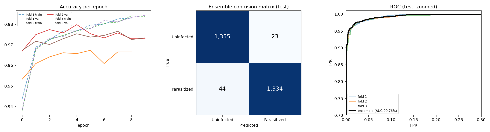
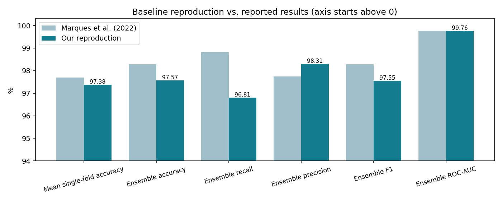

# Phase 2 Report: Automated Malaria Cell Detection

## 1. Baseline reproduction (Marques et al., 2022)

**Goal.** Rebuild the paper's model on the same data and check we land within about 1 percentage point of its reported results. This becomes our Phase 2 baseline (experiment A0).

**Method.**
- Data: NIH malaria cell images, 27,558 cells (13,779 parasitized, 13,779 uninfected), Kaggle mirror.
- Model: EfficientNet-B0 pretrained on ImageNet, 224 × 224 input, dropout 0.2.
- Training: Adam (lr 1e-4), ReduceLROnPlateau (patience 6, down to 1e-6), up to 15 epochs with early stopping (patience 5).
- Validation: 10 % untouched hold-out test set; the rest split by stratified 10-fold CV. We trained 3 of the 10 folds (free GPU budget) and averaged them into an ensemble.
- Hardware: Kaggle, 2× Tesla T4 (global batch 128).

**Results** (`results/A0_baseline/`):

| Metric | Paper | Ours | Δ (pp) |
|---|---|---|---|
| Mean single-fold accuracy | 97.70 % | 97.38 ± 0.74 % | −0.32 |
| Ensemble accuracy | 98.29 % | 97.57 % | −0.72 |
| Recall | 98.82 % | 96.81 % | −2.01 |
| Precision | 97.74 % | 98.31 % | +0.57 |
| F1 | 98.28 % | 97.55 % | −0.73 |
| ROC-AUC | 99.76 % | 99.76 % | 0.00 |
| MCC | — | 0.95 | — |

**Deviations from the paper.** We kept every setting the paper reports. Where it is silent or our compute was limited, we chose:

| Setting | Paper | Ours | Why |
|---|---|---|---|
| Augmentation | Albumentations (details not listed) | Flips + 90° rotations | Paper doesn't specify its pipeline |
| Epochs | Not reported | ≤ 15, early stopping (patience 5) | Fits a free GPU session |
| Folds trained | 10 | 3 of 10 | Free GPU budget (~21 min per fold) |
| Batch size | Not reported | 64 per GPU, 128 global (2× T4) | Kaggle provided two GPUs |
| Test set | Not described | 10 % hold-out, never used in training | Clean ensemble evaluation |

**Takeaway.** Both headline accuracies are within 1 pp of the paper, so the reproduction succeeds and A0 is our baseline. Recall is 2 pp lower: on the test set the model missed 44 infected cells and wrongly flagged 23 healthy ones. Training all 10 folds (as the paper did) may close part of this gap.

## 2. Hypothesis results

*To do after the A1–A3 runs.*
